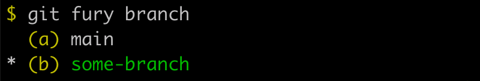
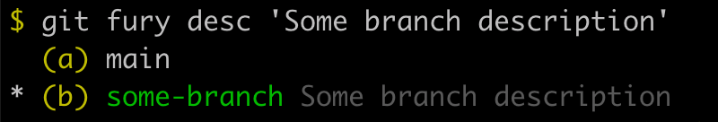

# Git Fury

A lightweight git utility that enables shorthand git syntax to sharpen your git fu and increase productivity.

## Table of Contents

- [Installation](#installation)
- [Usage](#usage)
- [Tips](#tips)

## Installation

```sh
npm install -g git-fury

### optionally set aliases to enhance productivity
git config --global alias.br 'fury branch'
git config --global alias.cp 'fury cherry-pick'
git config --global alias.co 'fury checkout'
git config --global alias.desc 'fury desc' # custom "git-fury" command to set and delete branch descriptions
git config --global alias.df 'fury diff'
git config --global alias.lg 'fury log --graph --oneline'
git config --global alias.mg 'fury merge'
git config --global alias.rb 'fury rebase'
git config --global alias.rs 'fury reset'
```

## Usage

### Shorthand syntax

##### Numbers get prepended with `HEAD~`
  - `git fury diff 2 1` expands to `git diff HEAD~2 HEAD~1`
  - `git df 2 1` also expands if the optional aliases are set up

##### Letters get expanded to branch names


 - `git co b` expands to `git checkout my-branch` (assuming aliases are set up)
 - `git rb -i a` expends to `git rebase -i master` (assuming aliases are set up)

### Manage Branch Descriptions

Branch descriptions allow you to add notes to branches.



```sh
git fury desc                    # Show description for current branch
git fury desc 'My description'   # Set description for current branch
git fury desc -D                 # Delete description current branch

git fury desc a                  # Show description for branch (a)
git fury desc a 'My description' # Set description for branch (a)
git fury desc a -D               # Delete description for branch (a)
```

## Tips
- It's useful to set a branch description to the URL of a Pull Request.
- Also useful to set branch description to the URL of the issue / user story for the project management or issue management software you're working with.
- Mac users can use iTerm2 can hyperclick on any branch descriptions formatted as a URL using cmd+click.
- Tired of typing `git`? Use bash aliases instead.